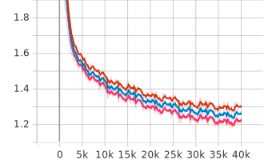
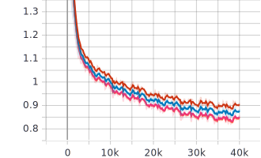

# Highway Transformer: Self-Gating Enhanced Self-Attentive Networks
This is demo source code of SDU enhanced Transformer-XL based on its PyTorch version.

Yekun Chai *et. al.*, [Highway Transformer: Self-Gating Enhanced Self-Attentive Networks](https://arxiv.org/abs/2004.08178) (ACL 2020)

## Requirements

- PyTorch >= 1.1.0
- TensorboardX >= 1.8
- Tensorboard >= 1.14
-  **4 GPUs** of each **8GB** memory for running 12 layer Transformer-XL

## Data download

`bash getdata.sh`

## Run the demo with 6-layer Transformer-XL
```bash
cd pytorch/xl_L6_scripts && bash <script-name>.sh train --work_dir "PATH_TO_WORK_DIR"
```

## Result visualization
```bash
cd XL-L6-results && tensorboard --logdir=.
```

## Results

Line plots of different model settings, where the topmost line (in red) is the original Transformer-XL (baselines).

training bpc    &nbsp;&nbsp;&nbsp;&nbsp;&nbsp;&nbsp;&nbsp;&nbsp;&nbsp;&nbsp;&nbsp;&nbsp;&nbsp;&nbsp;&nbsp;&nbsp;&nbsp;&nbsp;&nbsp;&nbsp;&nbsp;&nbsp;&nbsp;&nbsp;&nbsp;&nbsp;&nbsp;&nbsp;&nbsp;&nbsp;&nbsp;&nbsp;&nbsp;&nbsp;&nbsp;&nbsp;&nbsp;&nbsp;&nbsp;&nbsp;&nbsp;&nbsp;&nbsp;        |  training loss&nbsp;&nbsp;&nbsp;&nbsp;&nbsp;&nbsp;&nbsp;&nbsp;&nbsp;&nbsp;&nbsp;&nbsp;&nbsp;&nbsp;&nbsp;&nbsp;&nbsp;&nbsp;&nbsp;&nbsp;&nbsp;&nbsp;&nbsp;&nbsp;&nbsp;&nbsp;&nbsp;&nbsp;&nbsp;&nbsp;&nbsp;&nbsp;&nbsp;&nbsp;&nbsp;&nbsp;&nbsp;&nbsp;&nbsp;&nbsp;&nbsp;&nbsp;&nbsp; 
:-------------------------:|:-------------------------:
  |  

 

 eval bpc  &nbsp;&nbsp;&nbsp;&nbsp;&nbsp;&nbsp;&nbsp;&nbsp;&nbsp;&nbsp;&nbsp;&nbsp;&nbsp;&nbsp;&nbsp;&nbsp;&nbsp;&nbsp;&nbsp;&nbsp;&nbsp;&nbsp;&nbsp;&nbsp;&nbsp;&nbsp;&nbsp;&nbsp;&nbsp;&nbsp;&nbsp;&nbsp;&nbsp;&nbsp;&nbsp;&nbsp;&nbsp;&nbsp;&nbsp;&nbsp;&nbsp;&nbsp;&nbsp;       |  eval loss &nbsp;&nbsp;&nbsp;&nbsp;&nbsp;&nbsp;&nbsp;&nbsp;&nbsp;&nbsp;&nbsp;&nbsp;&nbsp;&nbsp;&nbsp;&nbsp;&nbsp;&nbsp;&nbsp;&nbsp;&nbsp;&nbsp;&nbsp;&nbsp;&nbsp;&nbsp;&nbsp;&nbsp;&nbsp;&nbsp;&nbsp;&nbsp;&nbsp;&nbsp;&nbsp;&nbsp;&nbsp;&nbsp;&nbsp;&nbsp;&nbsp;&nbsp;&nbsp; 
:-------------------------:|:-------------------------:
  |  


# Cite
```
@inproceedings{chai2020highway,
  title={Highway Transformer: Self-Gating Enhanced Self-Attentive Networks},
  author={Yekun, Chai and Shuo, Jin and Xinwen, Hou},
  booktitle={Proceedings of the 2020 Annual Conference of the Association for Computational Linguistics, {ACL} 2020, Seattle, Washington, United States, July 5–July 10, 2020},
  year={2020}
}
```
